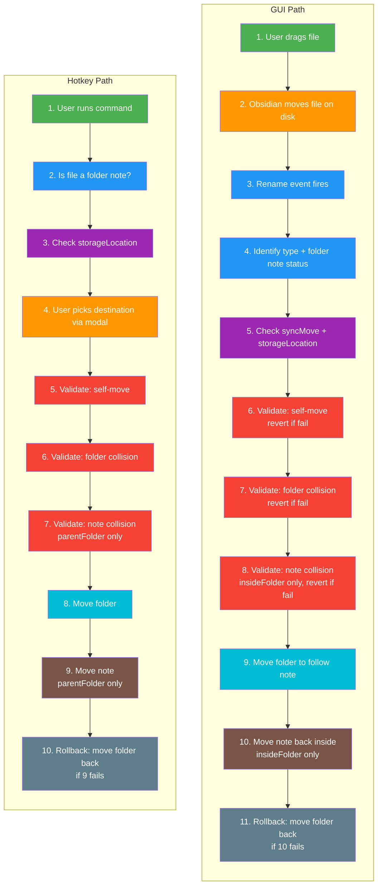
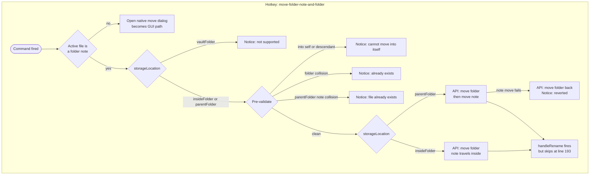

# handleRename — Move Logic

## Obsidian API Reference

| API | Description | Docs |
|---|---|---|
| [`FileManager.renameFile`](https://docs.obsidian.md/Reference/TypeScript+API/FileManager/renameFile) | Move or rename a file and update all links | [docs](https://docs.obsidian.md/Reference/TypeScript+API/FileManager/renameFile) |
| [`Vault.getAbstractFileByPath`](https://docs.obsidian.md/Reference/TypeScript+API/Vault/getAbstractFileByPath) | Retrieve a file or folder by vault-absolute path | [docs](https://docs.obsidian.md/Reference/TypeScript+API/Vault/getAbstractFileByPath) |
| [`Workspace.getActiveFile`](https://docs.obsidian.md/Reference/TypeScript+API/Workspace/getActiveFile) | Get the file for the currently active view | [docs](https://docs.obsidian.md/Reference/TypeScript+API/Workspace/getActiveFile) |
| `FileManager.promptForFileRename` | Open native rename/move dialog | *undocumented internal API* |
| `App.commands.executeCommandById` | Execute a command by ID | *undocumented internal API* |

Two independent flows handle file/folder moves. They never intersect in their core logic.

## Entry Points

| Entry | Trigger | Strategy |
|---|---|---|
| **GUI path** | User drags item in file explorer | **Reactive** — Obsidian moves the item first, plugin validates after and reverts or follows |
| **Hotkey path** | `move-folder-note-and-folder` command | **Proactive** — plugin validates first, then moves. `handleRename` fires but skips at line 193 |

## Temporal Comparison (color-matched by phase)

**Legend:** :green_square: Trigger | :orange_square: Destination | :blue_square: Identify | :purple_square: Settings | :red_square: Validate | :cyan_square: Move Folder | :brown_square: Move Note | :grey_square: Rollback



The inversion is visible by color — orange (destination) is step 4 in hotkey but step 2 in GUI.
Red (validation) is steps 5-7 in hotkey (pre-move) but 6-8 in GUI (post-move with reverts).

## Hotkey Path — Decision Tree (Commands.ts)



## GUI Path — Decision Tree (handleRename.ts)

```mermaid
graph TD
    subgraph gui ["GUI: file dragged in explorer"]
        DRAG([User drags item in file explorer])
        DRAG --> CORE["Obsidian core: item moved on disk"]
        CORE --> START(["Obsidian fires rename event"])
        START --> TYPE{What moved}

        TYPE -->|TFolder| F_STORE{storageLocation}
        TYPE -->|TFile was folder note| N_SYNC{syncMove}
        TYPE -->|TFile not folder note| R_DEST{Name matches<br>folder at dest}

        F_STORE -->|insideFolder| F1a["No-op<br>note already moved with folder"]
        F_STORE -->|parentFolder or vaultFolder| F_SYNC{syncMove}
        F_SYNC -->|false| F1b["No-op<br>note left behind at old path"]
        F_SYNC -->|true| F_NOTE{Has folder note}
        F_NOTE -->|no| F1c["No-op"]
        F_NOTE -->|yes| F1d["API: move note to new parent"]

        N_SYNC -->|false| N2a["Cleanup CSS<br>note stays where Obsidian put it"]
        N_SYNC -->|true| N_STORE{storageLocation}
        N_STORE -->|vaultFolder| N2b["No-op<br>note stays where Obsidian put it"]
        N_STORE -->|insideFolder| N_IN{Destination}
        N_STORE -->|parentFolder| N_PAR{Destination}

        N_IN -->|into self or descendant| N2c["API: move note back to old path<br>Notice"]
        N_IN -->|folder collision| N2d["API: move note back to old path<br>Notice"]
        N_IN -->|note collision| N2e["API: move note back to old path<br>Notice"]
        N_IN -->|clean| N2f["API: move folder to follow note<br>then move note back inside folder"]
        N2f -->|restore fails| N2f_R["API: move folder back to old path"]

        N_PAR -->|into self or descendant| N2g["API: move note back to old path<br>Notice"]
        N_PAR -->|folder collision| N2h["API: move note back to old path<br>Notice"]
        N_PAR -->|clean| N2i["API: move folder to follow note<br>note already at destination"]

        R_DEST -->|yes with existing note| R3a["API: move file back to old path"]
        R_DEST -->|yes no existing note| R_EXCL{Folder excluded}
        R_DEST -->|no match| R3f["No-op<br>regular file, nothing to sync"]
        R_EXCL -->|disableFolderNote| R3e["No-op"]
        R_EXCL -->|not excluded| R3b["Mark as folder note via CSS"]
    end
```

## GUI Path — All Code Paths by State

### State 1: Folder Moved

| # | storageLocation | syncMove | Has folder note? | Outcome |
|---|---|---|---|---|
| 1a | `insideFolder` | any | any | **No-op** — note is inside the folder, moves automatically |
| 1b | `parentFolder` | `false` | any | **No-op** |
| 1c | `parentFolder` | `true` | no | **No-op** |
| 1d | `parentFolder` | `true` | yes | **Move note** to folder's new parent directory |
| 1e | `vaultFolder` | `false` | any | **No-op** |
| 1f | `vaultFolder` | `true` | no | **No-op** |
| 1g | `vaultFolder` | `true` | yes | **Move note** to folder's new parent directory |

### State 2: Folder-Note File Moved Away

| # | storageLocation | syncMove | Destination condition | Outcome |
|---|---|---|---|---|
| 2a | any | `false` | any | **Cleanup** CSS classes only |
| 2b | `vaultFolder` | `true` | any | **No-op** — no stable parent semantics |
| 2c | `insideFolder` | `true` | Target is source folder or descendant | **Revert** + Notice |
| 2d | `insideFolder` | `true` | Folder name collision at destination | **Revert** + Notice |
| 2e | `insideFolder` | `true` | Note name collision inside target folder | **Revert** + Notice |
| 2f | `insideFolder` | `true` | Clean destination | **Move folder** + **restore note inside** (two-step with rollback) |
| 2g | `parentFolder` | `true` | Target is source folder or descendant | **Revert** + Notice |
| 2h | `parentFolder` | `true` | Folder name collision at destination | **Revert** + Notice |
| 2i | `parentFolder` | `true` | Clean destination | **Move folder** to follow note |

`insideFolder` has an extra validation (2e — note collision) and a two-step move (2f) vs. `parentFolder`'s single-step (2i).

### State 3: Non-Folder-Note File Moved

| # | storageLocation | Destination condition | Outcome |
|---|---|---|---|
| 3a | any | Name matches a folder that already has a folder note | **Revert** move to old path |
| 3b | any | Name matches folder, no existing note, not excluded | **Mark as folder note** via CSS |
| 3e | any | Folder has `disableFolderNote` exclusion | **No-op** |
| 3f | any | Name doesn't match any folder at destination | **No-op** |

## Summary

| Initial state | Paths |
|---|---|
| Folder | 7 (1a-1g) |
| Folder-note file | 9 (2a-2i) |
| Regular file | 4 (3a, 3b, 3e, 3f) |
| **GUI total** | **20** |
| **Hotkey total** | **7** (fallback, unsupported, 3 validations, 2 executions) |

## Hotkey vs GUI Comparison

| | GUI (drag in explorer) | Hotkey command |
|---|---|---|
| **When validation happens** | After Obsidian moved the file — plugin must revert on error | Before any file moves — rejects early with a Notice |
| **Who moves what first** | User moves the note, plugin moves the folder to follow | Plugin moves the folder first, then moves the note |
| **Rollback mechanism** | `revertMovedFolderNote` renames note back | Catches `renameFile` failure, renames folder back |
| **handleRename interaction** | Full decision tree runs | Sets `isRunningMoveFolderWithNoteCommand = true`, skips at line 193 |
| **Non-folder-note files** | Falls through to State 3 | Falls back to native `app:move-file` dialog (becomes GUI path) |
| **vaultFolder support** | State 2 silently no-ops | Explicitly blocked with Notice |
| **insideFolder move** | Two-step: move folder, restore note inside (with rollback) | Single-step: move folder, note is already inside |
| **parentFolder move** | Single-step: move folder to follow note (note already at dest) | Two-step: move folder, then move note (with rollback) |
