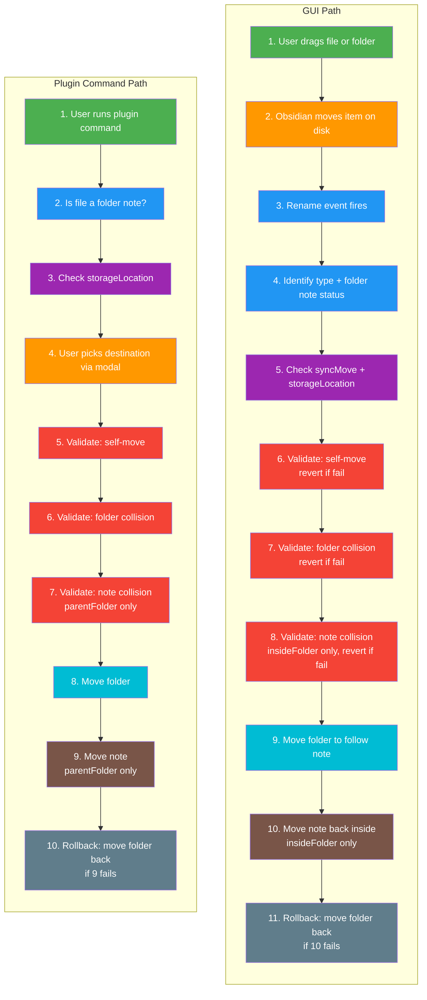
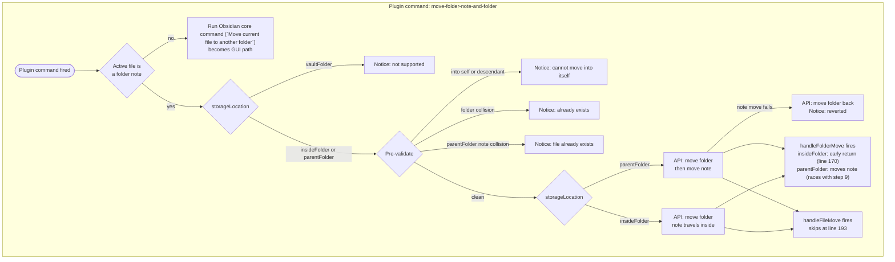
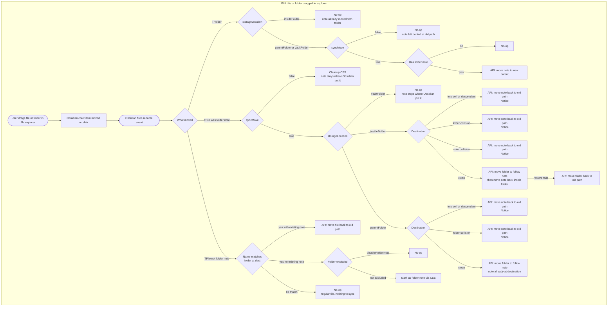

# handleRename — Move Logic

## What This Doc Covers

This file documents how Folder Notes reacts to Obsidian `rename` events, including both:
- **Move events** (parent path changed)
- **Rename events** (same parent, name changed)

It combines two entry sources:
- **GUI path**: user drags a file or folder in File Explorer (Obsidian moves first)
- **Plugin command path**: plugin command `move-folder-note-and-folder` (plugin validates and moves first)

## Quick Summary

- There are two move strategies:
  - **Reactive (GUI drag/drop)**: Obsidian performs the move, then plugin validates and may revert.
  - **Proactive (plugin command)**: plugin validates destination first, then performs move(s).
- `handleRename` is the central dispatcher for both file and folder rename/move events.
- The plugin includes multiple reentrancy guards because its own `renameFile(...)` calls emit additional rename events.
- For non-folder-note files, the plugin command falls back to Obsidian’s native move UI (`app:move-file` / `file-explorer:move-file`, then `promptForFileRename` as last resort).

## Obsidian API Reference

| API | Description | Docs |
|---|---|---|
| [`FileManager.renameFile`](https://docs.obsidian.md/Reference/TypeScript+API/FileManager/renameFile) | Move or rename a file and update all links | [docs](https://docs.obsidian.md/Reference/TypeScript+API/FileManager/renameFile) |
| [`Vault.getAbstractFileByPath`](https://docs.obsidian.md/Reference/TypeScript+API/Vault/getAbstractFileByPath) | Retrieve a file or folder by vault-absolute path | [docs](https://docs.obsidian.md/Reference/TypeScript+API/Vault/getAbstractFileByPath) |
| [`Workspace.getActiveFile`](https://docs.obsidian.md/Reference/TypeScript+API/Workspace/getActiveFile) | Get the file for the currently active view | [docs](https://docs.obsidian.md/Reference/TypeScript+API/Workspace/getActiveFile) |
| `FileManager.promptForFileRename` | Open native rename/move dialog | *undocumented internal API* |
| `App.commands.executeCommandById` | Execute a command by ID | *undocumented internal API* |

Two independent flows handle file/folder moves. They never intersect in their core logic.

## Entry Points

| Entry | Trigger | Strategy |
|---|---|---|
| **GUI path** | User drags **file or folder** in file explorer | **Reactive** — Obsidian moves the item first, plugin validates after and reverts or follows |
| **Plugin command path** | `move-folder-note-and-folder` plugin command | **Proactive** — plugin validates first, then moves. `handleFileMove` skips at line 193; `handleFolderMove` still runs (see [concurrency note](#plugin-command--handlefoldermove-concurrency)) |

## Plugin vs Core Command Mapping

The Folder Notes plugin command is:
- ID: `move-folder-note-and-folder`
- Name: **Folder notes: Move folder note and folder** (command palette prefix + command name)

When the active file is **not** a folder note, the plugin command intentionally falls back to Obsidian core move UX:
- `Move current file to another folder` (Obsidian core command wording)
- `app:move-file` (internal command ID used by this plugin)
- `file-explorer:move-file`
- `FileManager.promptForFileRename` (internal fallback)

## Temporal Comparison (color-matched by phase)

**Legend:** :green_square: Trigger | :orange_square: Destination | :blue_square: Identify | :purple_square: Settings | :red_square: Validate | :cyan_square: Move Folder | :brown_square: Move Note | :grey_square: Rollback



The inversion is visible by color — orange (destination) is step 4 in plugin command flow but step 2 in GUI.
Red (validation) is steps 5-7 in plugin command flow (pre-move) but 6-8 in GUI (post-move with reverts).

## Plugin Command Path — Decision Tree (Commands.ts)



## GUI Path — Decision Tree (handleRename.ts)



## GUI Path — All Code Paths by State

### State 1: Folder Moved

| # | storageLocation | syncMove | Has folder note? | Outcome |
|---|---|---|---|---|
| 1a | `insideFolder` | any | any | **No-op** — note is inside the folder, moves automatically |
| 1b | `parentFolder` | `false` | any | **No-op** |
| 1c | `parentFolder` | `true` | no | **No-op** |
| 1d | `parentFolder` | `true` | yes | **Move note** to folder's new parent directory |
| 1e | `vaultFolder` | `false` | any | **No-op** |
| 1f | `vaultFolder` | `true` | no | **No-op** |
| 1g | `vaultFolder` | `true` | yes | **Move note** to folder's new parent directory |

### State 2: Folder-Note File Moved Away

| # | storageLocation | syncMove | Destination condition | Outcome |
|---|---|---|---|---|
| 2a | any | `false` | any | **Cleanup** CSS classes only |
| 2b | `vaultFolder` | `true` | any | **No-op** — no stable parent semantics |
| 2c | `insideFolder` | `true` | Target is source folder or descendant | **Revert** + Notice |
| 2d | `insideFolder` | `true` | Folder name collision at destination | **Revert** + Notice |
| 2e | `insideFolder` | `true` | Note name collision inside target folder | **Revert** + Notice |
| 2f | `insideFolder` | `true` | Clean destination | **Move folder** + **restore note inside** (two-step with rollback) |
| 2g | `parentFolder` | `true` | Target is source folder or descendant | **Revert** + Notice |
| 2h | `parentFolder` | `true` | Folder name collision at destination | **Revert** + Notice |
| 2i | `parentFolder` | `true` | Clean destination | **Move folder** to follow note |

`insideFolder` has an extra validation (2e — note collision) and a two-step move (2f) vs. `parentFolder`'s single-step (2i).

### State 3: Non-Folder-Note File Moved

| # | storageLocation | Destination condition | Outcome |
|---|---|---|---|
| 3a | any | Name matches a folder that already has a folder note | **Revert** move to old path |
| 3b | any | Name matches folder, no existing note, not excluded | **Mark as folder note** via CSS |
| 3e | any | Folder has `disableFolderNote` exclusion | **No-op** |
| 3f | any | Name doesn't match any folder at destination | **No-op** |

## Summary

| Initial state | Paths |
|---|---|
| Folder | 7 (1a-1g) |
| Folder-note file | 9 (2a-2i) |
| Regular file | 4 (3a, 3b, 3e, 3f) |
| **GUI total** | **20** |
| **Plugin command total** | **7** (fallback, unsupported, 3 validations, 2 executions) |

## Plugin Command vs GUI Comparison

| | GUI (drag in explorer) | Plugin command |
|---|---|---|
| **When validation happens** | After Obsidian moved the file — plugin must revert on error | Before any file moves — rejects early with a Notice |
| **Who moves what first** | User moves the note, plugin moves the folder to follow | Plugin moves the folder first, then moves the note |
| **Rollback mechanism** | `revertMovedFolderNote` renames note back | Catches `renameFile` failure, renames folder back |
| **handleRename interaction** | Full decision tree runs | Sets `isRunningMoveFolderWithNoteCommand = true`; `handleFileMove` skips at line 193, but `handleFolderMove` still runs unguarded (see [concurrency note](#plugin-command--handlefoldermove-concurrency)) |
| **Non-folder-note files** | Falls through to State 3 | Falls back to native `Move current file to another folder` dialog (becomes GUI path) |
| **vaultFolder support** | State 2 silently no-ops | Explicitly blocked with Notice |
| **insideFolder move** | Two-step: move folder, restore note inside (with rollback) | Single-step: move folder, note is already inside |
| **parentFolder move** | Single-step: move folder to follow note (note already at dest) | Two-step: move folder, then move note (with rollback) |

## Reentrancy Guards

The plugin's own `renameFile` calls trigger new Obsidian rename events. Without protection, this creates infinite loops. Three mechanisms prevent this:

### `withMoveGuard` (line 51)

Wraps a critical section. Any paths added to `guardedFolderPaths` or `guardedFilePaths` cause `handleFileMove` to bail at line 202 via `isGuardedMovePath`. Folder guards also cover all descendant paths (`path.startsWith(folderPath/)`). Guards are removed in a `finally` block so they clean up even on error.

Used by:
- `handleFileMove` State 2f/2i (line 272) — guards both the source and destination folder/file paths during folder-follows-note moves
- `revertMovedFolderNote` (line 95) — guards both old and new path during revert

### `suppressedFileMoveEvents` (line 23)

A one-shot suppression keyed on `fromPath=>toPath`. When the plugin is about to trigger a rename that would re-enter `handleFileMove`, it registers the exact expected event key. `consumeSuppressedFileMoveEvent` (line 29) checks and deletes the key, returning `true` once. This is more targeted than `withMoveGuard` — it suppresses exactly one specific event.

Used by:
- `revertMovedFolderNote` (line 94) — suppresses the revert rename event so it doesn't re-enter move logic

### `isRunningMoveFolderWithNoteCommand` (line 193)

A boolean flag on the plugin instance. Set to `true` by the plugin command in `Commands.ts` (line 413), cleared in a `finally` block (line 433). Causes `handleFileMove` to return immediately. This is the simplest guard — a whole-function bypass for the duration of the plugin command.

> **Scope limitation:** This flag only guards `handleFileMove`. It does **not** guard `handleFolderMove`. When the plugin command moves a folder, the resulting rename event dispatches to `handleFolderMove`, which runs without any guard. See [Plugin Command + handleFolderMove Concurrency](#plugin-command--handlefoldermove-concurrency) for implications.

### Plugin Command + `handleFolderMove` Concurrency

When the plugin command calls `await renameFile(linkedFolder, newFolderPath)`, the folder rename event fires and `handleFolderMove` runs — unguarded by `isRunningMoveFolderWithNoteCommand`. For `parentFolder` storage with `syncMove: true`, `handleFolderMove` finds the note at its old path and calls `renameFile(folderNote, newPath)` **without await** (line 184). The command then resumes and checks `file.path === targetNotePath` to decide whether to move the note itself.

The command avoids a double-move because Obsidian's `renameFile` appears to update `TFile.path` synchronously on the object reference before the returned Promise resolves. By the time the command's `await` completes, `file.path` already reflects the move performed by `handleFolderMove`, so the `file.path === targetNotePath` guard (Commands.ts) evaluates to `true` and the command skips its own note move.

**This relies on an undocumented Obsidian implementation detail.** If `renameFile` were to defer the `TFile.path` update, the command would attempt a second move on an already-moved file. Per-storage breakdown:

| storageLocation | Plugin command behavior | `handleFolderMove` behavior | Race? |
|---|---|---|---|
| `insideFolder` | Moves folder; note travels inside | Returns early at line 170 | **No** |
| `parentFolder` | Moves folder, then moves note | Also moves note (fire-and-forget) | **Yes** — avoided by `file.path` check |
| `vaultFolder` | Blocked with Notice | Would run (buggy destination — see 1g) | **N/A** — command exits before reaching `renameFile` |

## Concurrency Model

There is no debouncing or queueing in `handleRename`. Each Obsidian rename event is dispatched independently. The reentrancy guards (`withMoveGuard`, `suppressedFileMoveEvents`, `isRunningMoveFolderWithNoteCommand`) protect against **cascading events from a single logical operation** — they do not serialize concurrent user operations.

If the user triggers rapid successive renames (e.g., drag-dropping multiple items quickly), each event runs its own handler instance. Because `handleFileMove` is `async` and guards are set/cleared per-operation:

1. Operation A sets guards, starts moving
2. Operation B fires — its paths may or may not overlap A's guarded paths
3. A's `finally` block clears its guards
4. B continues without coverage from A's guards

In practice this is unlikely to cause issues because Obsidian serializes user-initiated file operations in the explorer, and vault events fire in order. But programmatic callers that trigger multiple rapid `renameFile` calls should be aware that guard sets are per-operation, not global locks.

## Rename Handling

`handleRename` dispatches renames (same parent, different name) separately from moves. This is the other half of the dispatch at lines 133-144.

### Folder Rename (`handleFolderRename`, line 374)

When a folder is renamed, the folder note's filename must sync to match.

> **`folderNote.path` mutation (lines 402, 405, 409):** `handleFolderRename` directly mutates `folderNote.path` before calling `renameFile`. This is a workaround: `getFolderNote(plugin, oldPath)` resolves the `TFile` using the **old** folder path, but for `insideFolder` storage the note has physically moved with the folder (it's inside it). The `TFile` reference may still hold the stale pre-rename path. Direct mutation ensures `renameFile` sees the correct current location. For `parentFolder` storage this mutation is a no-op (the note didn't move when the folder was renamed).

| # | storageLocation | syncFolderName | Has folder note | Outcome | Line |
|---|---|---|---|---|---|
| R1 | any | any | no | **No-op** | 384 |
| R2 | any | any | yes, excluded with `disableSync` | **Unreachable with current guard** (`folderNote` is guaranteed before this branch) | 388 |
| R3 | any | `false` | yes | **No-op** | 392 |
| R4 | `parentFolder` | `true` | yes, parent also changed | **No-op** if `!syncMove`, else rename note at new parent | 398 |
| R5 | `parentFolder` | `true` | yes, same parent | **Rename note** to match new folder name | 405 |
| R6 | `insideFolder` | `true` | yes | **Rename note** inside folder to match new folder name | 409 |

### File Rename (`handleFileRename`, line 416)

When a file is renamed, it may become or stop being a folder note.

| # | Condition | syncFolderName | Outcome | Line |
|---|---|---|---|---|
| FR1 | New name matches a folder, not excluded, not detached | any | **Mark as folder note** via CSS | 436 |
| FR2 | Name no longer matches any folder | any | **Remove** folder note CSS classes | 444 |
| FR3 | Excluded with `disableSync` or `syncFolderName=false` | n/a | **No-op** (early return) | 449 |
| FR4 | New name matches same folder it was already in | `true` | **Update CSS** — re-mark file and folder | 454 |
| FR5 | Was a folder note, renamed — folder should follow | `true` | **Rename folder** to match new note name | 460 |
| FR5a | ...but a folder with that name already exists | `true` | **Revert** file rename + Notice | 498 |

## CSS Class Lifecycle (`only-has-folder-note`)

Lines 113-127 run on **every** rename event, before the move/rename dispatch. They maintain the `only-has-folder-note` CSS class on both the new and old parent folders:

```
if folder is empty (only has its folder note) AND has a folder note:
    add 'only-has-folder-note'
else:
    remove 'only-has-folder-note'
```

This check uses `plugin.isEmptyFolderNoteFolder()` and runs for both `file.parent` (new location) and the old folder (resolved from `oldPath`). It ensures the class updates immediately when files move in or out of a folder.

## Excluded Folder Path Updates (`updateExcludedFolderPath`, line 506)

Runs on every folder rename/move event (line 132), before the rename/move dispatch. When a folder's path changes, any exclusion rules targeting that folder become stale. This function:

1. Finds all excluded folder entries whose `path` includes the old path (line 511)
2. For exact matches: replaces the path directly (line 517)
3. For nested matches: splits on `/`, replaces the matching segment, rejoins (line 521-527)
4. Saves settings (line 529)

This runs regardless of `syncMove` or `syncFolderName` — exclusion rules always track folder paths.

> **Bug: nested path replacement is broken (line 526).** The code does `folders[folders.indexOf(folder.name)] = folder.name`, where `folder.name` is the **new** name after the rename. For renames, the old path segments contain the old name, so `indexOf(newName)` returns `-1` and the assignment sets a numeric property on the array without modifying any element. For moves (name unchanged), it finds the name but replaces it with itself — a no-op — while the parent path change is what actually needs updating. Only exact-match paths (line 517) are updated correctly; nested excluded paths become stale after both renames and moves.

## Source Line Reference

| Path ID | Function | Line |
|---|---|---|
| 1a-1g | `handleFolderMove` | 169 |
| 2a | `handleFileMove` — `cleanupMovedFolderNote` | 224 |
| 2b | `handleFileMove` — vaultFolder early return | 229 |
| 2c-2e | `handleFileMove` — `revertMovedFolderNote` | 240, 249, 259 |
| 2f | `handleFileMove` — `withMoveGuard` + two-step move | 272 |
| 2g-2h | `handleFileMove` — `revertMovedFolderNote` | 240, 249 |
| 2i | `handleFileMove` — `withMoveGuard` + single move | 272 |
| 3a | `handleFileMove` — `renameExistingFolderNote` | 218 |
| 3b | `handleFileMove` — `markFileAsFolderNote` | 296 |
| 3e | `handleFileMove` — excluded early return | 295 |
| 3f | `handleFileMove` — implicit fall-through | 308 |
| R1-R6 | `handleFolderRename` | 374 |
| FR1-FR5 | `handleFileRename` | 416 |

## Known Edge Cases

### 1g: `vaultFolder` folder move uses wrong destination

`handleFolderMove` (line 181) computes `newFolder.parent?.path / folderNote.name` for the note's new path. For `parentFolder` this is correct — the note should sit next to the folder. But for `vaultFolder` the note should stay in the configured vault folder, not move to the folder's new parent. This path moves the note **out of** the vault folder.

### 3a: `renameExistingFolderNote` temporarily modifies exclusion rules

When a file is moved into a folder where it would become a folder note but one already exists (line 339), the plugin reverts the move via `renameFile(file, oldPath)`. But this revert would itself trigger sync logic (renaming the folder to match). To prevent this, `renameExistingFolderNote`:

1. If no exclusion exists for the folder: **creates a temporary one** (`addExcludedFolder`, line 355)
2. If one exists but `disableSync` is false: **temporarily sets `disableSync = true`** (line 358)
3. Calls `renameFile` to revert
4. In the `.then()` callback: **removes the temporary exclusion** or **restores `disableSync`** (lines 363-368)

This is a workaround to suppress rename-sync during revert without using the guard mechanism.

### `handleFolderMove` uses no reentrancy guards

`handleFolderMove` (line 169) calls `renameFile(folderNote, newPath)` without `withMoveGuard`, `suppressedFileMoveEvents`, or `isRunningMoveFolderWithNoteCommand`. The cascading rename event is for a **file** (the moved note), not a folder, so it enters `handleFileMove` — which has all three guards. The lack of guards on `handleFolderMove` itself is safe because the cascading event cannot re-enter `handleFolderMove`. However, the fire-and-forget `renameFile` call (no `await`) means the note move runs concurrently with any caller that `await`s the folder rename. See [Plugin Command + handleFolderMove Concurrency](#plugin-command--handlefoldermove-concurrency) for the interaction with the plugin command.

### Rename handlers don't use reentrancy guards

`handleFolderRename` (line 412) and `renameFolderOnFileRename` (line 503) call `renameFile` without `withMoveGuard`. Their rename events will re-enter `handleRename`, relying on the new name/path being correct to exit early (e.g., `fileName === oldFileName` at line 381). The `renameExistingFolderNote` workaround above is evidence this implicit approach requires special handling.
